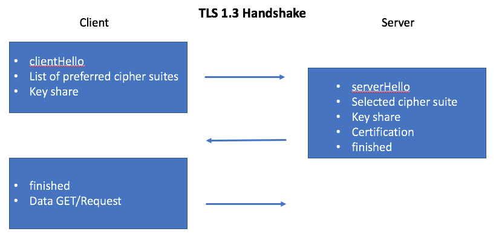

# Server/Client



## Client

* getting certificates from server
* checking SSL handshake
* [cert-info](cert-info)

```bash
# certificate
echo -n | openssl s_client -connect www.google.de:443

# scripted
cert-info www.google.de
```

## Server

* detailed TLS server
* checking SSL handshake

```bash
openssl req -x509 -newkey rsa:4096 -keyout key.pem -nodes -subj '/CN=localhost' -days 365 -out server.pem

# serve on port 4433
openssl s_server -cert server.pem -key key.pem -www
```

## SSL Labs

https://www.ssllabs.com/ssltest/analyze.html
